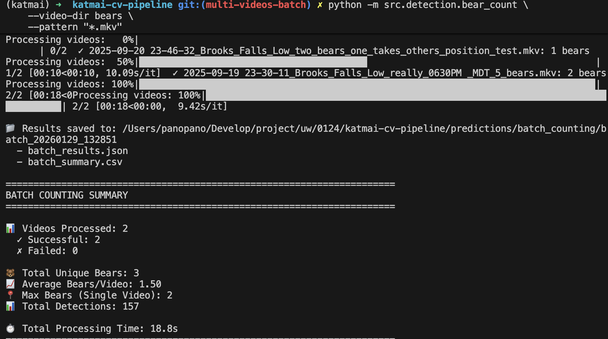
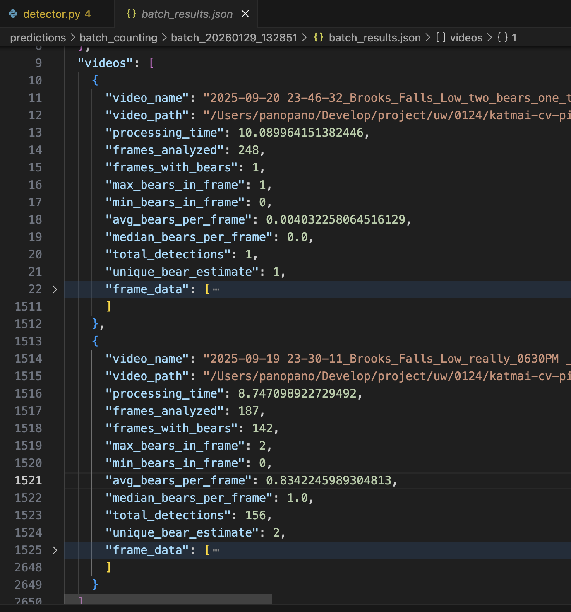

# Overview
This document describes the design of a bear counting feature for offline video analysis. The goal of this feature is to automatically detect bears from multiple static-camera videos and produce aggregated counting results that can be used for downstream analysis and reporting.

The system focuses on:

- Bear detection using a fine-tuned YOLOv8 object detection model

- Processing multiple input videos in batch

- Aggregating per-frame detection results to estimate bear presence over time

This feature is designed for offline processing and analysis rather than real-time tracking.

# Input & Output
## Input
- Raw video data
  - Location: /data/raw/bears/
  - Format: .mkv
- Training / fine-tuning data (optional)
  - Location: /data/annotation/bears/
  - Format: extracted frames and annotations (generated using CVAT)
  - Used only when re-training or fine-tuning the YOLOv8 model

## Output
After running bear_count.py, the system produces:
- Terminal output
  - Aggregated bear count statistics across all processed videos
- Batch-level results directory
  - Location: /predictions/batch_counting/
  - Files generated:
    - batch_results.json:
      - Contains structured metadata and aggregated detection results for the entire batch
    - batch_summary.csv:
      - Contains frame-by-frame detection statistics, useful for analysis and visualization

Example output visualization:

The batch_summary.csv includes per-frame information such as:
- Video ID
- Frame index
- Number of detected bears
- Confidence-related statistics
This format is designed to support future dashboard or analytics integration.

# System Architecture
The bear counting system follows a modular, batch-processing architecture:
1. Video Loader
- Iterates through all videos in the input directory
- Extracts frames at a configurable sampling rate

2. Bear Detector
- Uses a YOLOv8 model fine-tuned for bear detection
- Runs inference on sampled frames
- Outputs bounding boxes and confidence scores

3. Frame-level Aggregator
- Aggregates detections per frame
- Applies confidence thresholds and filtering logic

4. Batch-level Aggregator
- Combines results across all videos
- Produces summary statistics and metadata

5. Result Writer
- Saves JSON and CSV outputs to disk
- Logs key statistics to the terminal

# Assumptions & Limitations
## Assumptions
- Cameras are static (no camera motion)
- Bears are visually distinguishable in the frame
- Over-counting across frames is acceptable for batch-level analysis
- Video quality is sufficient for object detection

## Limitations
- No multi-object tracking (the same bear may be counted in multiple frames)
- Occlusion or overlapping bears may reduce detection accuracy
- Performance depends heavily on lighting, weather, and camera angle
- Not suitable for real-time deployment in its current form

# Failure Cases
Common failure cases include:
- Missed detections when bears are far from the camera
- False positives caused by rocks, shadows, or other animals
- Low-light or night-time footage
- Bears partially occluded by terrain or vegetation

# Future Work
Planned or possible improvements include:
- Adding object tracking to avoid double-counting across frames
- Temporal smoothing of detection counts
- Integration with a visualization dashboard
- Improved evaluation with ground-truth annotations

# References
https://github.com/katmai-vision-lab/.github/issues/39

https://github.com/katmai-vision-lab/katmai-cv-pipeline/pull/10
