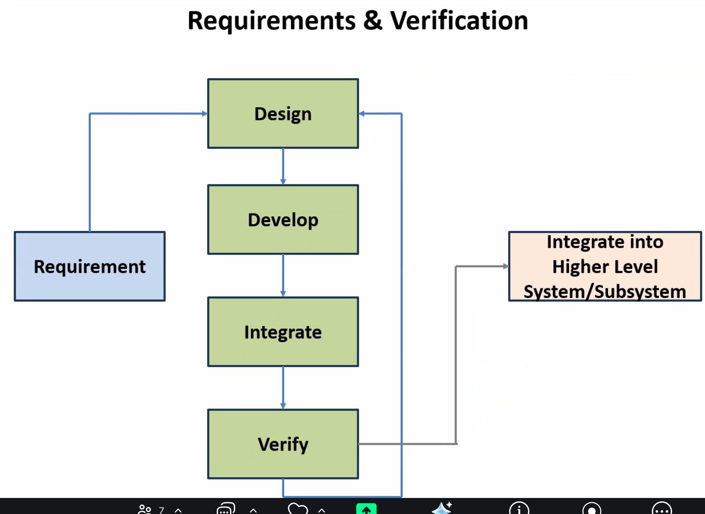

# Meeting Notes
## 2026 Winter
### Jan 13th Sponsor
- plan things, break down is important
- develop feature iteraterably

**Requirements**
- requirement need to be single, NOT use “and”
- be verifiable (analysis, inspection, demonstration, test) of the requirement. Clarify the “done cretiria” of the requirement
- write requirement in tech/science mind
- break done big requirement to small, simple task

**Camera & Video**

- Camera operator looking for a bear, zoom bear eat, then looking for another bear

- 2T data

## Jan 15th Internal
### Agenda
- Go through project proposal
- Walk through lab 10:15 Tuesday
- Sprint 1 Planning

